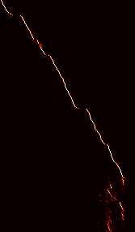

# Attention-based End-to-end Speech-to-text Translation Neural Network
The model translates speech recordings to their corresponding transcripts with an attention mechanism. 
## Introduction
This is a character-based prediction model that consists of an encoder and an attention-based decoder. The encoder uses a pyramidal-LSTM to extract speech embeddings, and the decoder learns to focus on important portion of embeddings and is able to generate corresponding translations. Recordings were converted to spectrograms ahead of time, which contain 40 frequency bands. 
## Installation
```
conda env create -f environment.yaml`
pip install -r requirements.txt
mkdir Data
mkdir Checkpoints
```
## Training
```
cd Code
python3 main.py
```
Dynamic teacher-forcing rate was implemented to improve performance. It takes around 10 epoch for the model to form a diagonal attention plot, which is shown below. The vertical direction stands for embedding, and the horizontal direction represents time steps.  After about 35 epochs, the model started converging and finally achieved edit distance of around 10. 
<div align="center">
  
</div>

Training result samples:
```
Label: 
the other nods understanding sweeps the dust slate level with his hand and with his forefinger inscribes similar characters they are talking they cannot speak to each other but they can write
Prediction:
the other nods understanding swipss the dust slate level with his hand and with his forefinger inscribes somelar characters they are talking they cannot speak to each other but they can rrite
```
```
Label:
as she lay dying he sat up whole nights with her in a great chair would suffer nobody to give her medicine or even cook her food but himself and read novels to her in her intervals of ease
Prediction:
as she lay dying he sat up whole nights with her in a great chair would suffer no bdd to give her medicine or even cook her food but himself and read novels to her in her indervals of ease
```

## Validation
The best validation edit distance is around 20. Since no supervision was provided during validation, the edit distance became higher compared to the training edit distance.
```
Label: 
besides i was of opinion that a man's profession whatever it might be ought to supply him with enough money to satisfy all his wants and the very poor pay of an officer would never have been sufficient to cover my expenses because my education had given me greater wants than those of officers in general
Prediction:
besides i was of opinion that a bands profession whatever it might be altisoplied him with enough money to satisfy all his once and the very port pay of an officer would never have been sufficient to cover my expenses because my education had given me greater ones it those of opposis in general
```
```
Label:
i declared myself quite willing for it was necessary to brazen it out after having ventured as far as i had done
Prediction:
i declared myself quite willing for it was necessary comprision it out after having bentred as far as i had done
```
